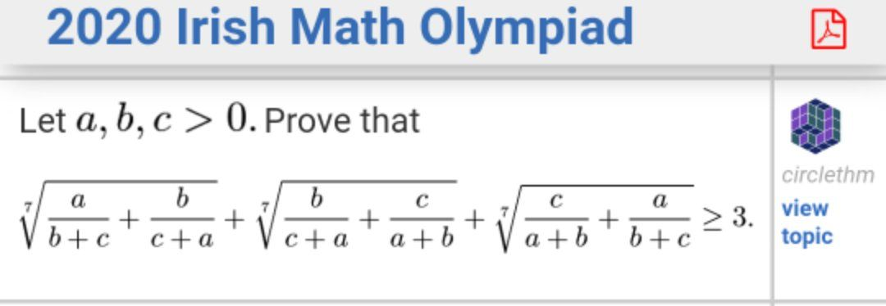

# The question shown
- Given a, b, c > 0, Prove that
```math
(\frac{a}{b+c} + \frac{b}{c+a}) ^ \frac{1}{7} + (\frac{b}{c+a} + \frac{c}{a+b}) ^ \frac{1}{7} + (\frac{c}{a+b} + \frac{a}{b+c}) ^ \frac{1}{7} \geq 3
```

- Readers can refer to LaTex-like formula reference here: https://docs.github.com/en/get-started/writing-on-github/working-with-advanced-formatting/writing-mathematical-expressions

