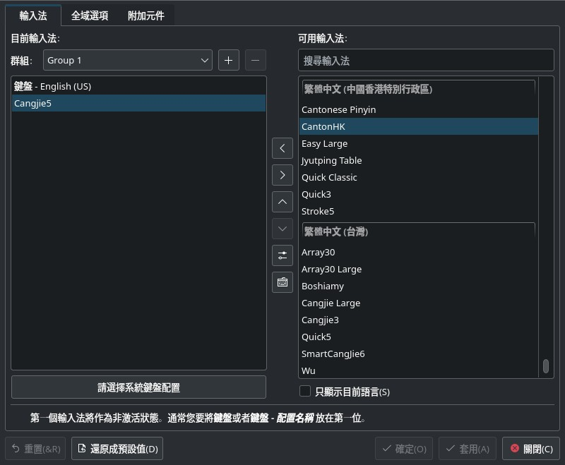
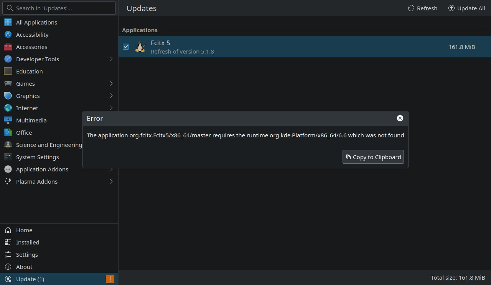

# Install cangjie3/ cangjie5 under fcitx5 in steamdeck

Normally Steamdeck only support software installation by flatpak. Steamdeck user can install software of ArchLinux OS but those software will be erased at system upgrade. But its default cangjie input method is unfriendly for Traditional Chinese users. It is much better to use cangjie3/ cangjie5 instead. But these two input methods are not readily available in steamdeck. This guide is to address how to install cangjie3/ cangjie5 under fcitx5 flatpak.

一般情況 Steamdeck 只支援以 Flatpak 安裝軟件。使用者有方法安裝 ArchLinux 的軟件，但這些軟件都在每次系統更新後被移除。而它的預設倉頡輸入法不便利正體中文使用者，使用三代倉頡或五代倉頡有更好效果。可是這兩個輪入法並不是立即能用，本篇目的旨在安裝三代倉頡或五代倉頡輸入法。

## Using unstable flatpak of offical fcitx5
- ```TableExtra``` addon package is hosted under ```fcitx5-unstable``` flatpak repository. Add this repository to your steamdeck. You need TableExtra addon to configure Fcitx5 with cangjie3/ cangjie5. 你需要在增加軟件庫 ```fcitx5-unstable``` 於你的 Steamdeck 下，它的附加軟件 ```TableExtra``` 是三代倉頡或五代倉頡所需。
```
flatpak remote-add --user --if-not-exists fcitx5-unstable https://flatpak.fcitx-im.org/unstable-repo/fcitx5-unstable.flatpakrepo
```

- Verify the repositories being recognized. Note that your steamdeck has at least ```flatpak``` by default. 確定你的系統認可的軟件庫。你的 Steamdeck 在出廠時最少已認可 ```flatpak``` 軟件庫。
```
flatpak remotes
```

- List the software package being installed and verify their repository (origin). *Widen your terminal to 120 characters width* to display more information about your packages. 列出你的軟件和他們的來源軟件庫 (origin)。把終端器擴闊至 120 字元以方便看到更多軟件資料。
```
flatpak list
flatpak info org.fcitx.Fcitx5
flatpak info org.fcitx.Fcitx5.Addon.ChineseAddons
```

- Uninstall offical fcitx5, if the source is not ```fcitx5-unstable```. Skip this step if fcitx5 is not installed. 如果你已經安裝了 Fcitx5 而來源並不是```fcitx5-unstable```，移除它們。
```
flatpak uninstall org.fcitx.Fcitx5
flatpak uninstall org.fcitx.Fcitx5.Addon.ChineseAddons
```

- These three packages MUST comes from the same flatpak source. That is all fcitx5 packages comes from fcitx5-unstable. 這三個軟件必須從同一軟件庫，即是全部都來自 ```fcitx5-unstable```。
```
flatpak install fcitx5-unstable org.fcitx.Fcitx5
flatpak install fcitx5-unstable org.fcitx.Fcitx5.Addon.ChineseAddons
flatpak install fcitx5-unstable org.fcitx.Fcitx5.Addon.TableExtra
```

- You need to logout and re-logon and configure your Fcitx5 software again. After re-login, cangjie3/ cangjie5 are available for configuration. The new input methods are put under zh-HK (香港) or zh-TW (台灣) locales, which are different from other Chinese Addons with zh-CN (中国) locales. 你需要登出戶口再登入，之後就可以在 Fcitx5 軟件下找到三代倉頡和五代倉頡。新輸人法在香港和台灣的 locale 下，與其他中文輸入法的中国 locale 並不同類。


## Steamdeck update failure message
You may be asked to update the Fcitx5, but the update fails. Ignore the update failure message. Skip update of this software. 你會被要求更新 Fcitx5 軟件，然後更新失敗。可以無視這項通知。以後不必更新這項軟件。


## Why cangjie3/ cangjie5 is preferred over default cangjie?
The choice of input method is only a matter of taste. However there is some inconvenience to use default cangjie input method under fcitx5 for Traditional Chinese users. Fcitx5 consider some words are identical, like 台 / 臺，and 体 / 體. Default cangjie input method always returns 臺 on cangjie code of 台 (IR 戈口), and returns 體 on cangjie code of 体 (ODM 人木一). Cangjie input method only relies on glyphs, this makes automatic conversion painful when using Cangjie. There is no such conversion in cangjie3/ cangjie5. 

選擇使用什麼輸入法只是口味問題。可是，在 Fcitx5 框架下的預設倉頡輸入法對正體中文使用者帶來不便。它視一些字為相同，例如「台」「臺」和「体」「體」。預設倉頡輸入法在收到「台」的輸入碼（戈口）後輸出「臺」，收到「体」的輸入碼（戈口）後輸出「體」。因為倉頡輸入法的取碼只考慮字符，自動轉換令使用倉頡輸入法時痛苦。而 Fcitx5 框架下的三代倉頡和五代倉頡都沒有自動轉換的情況。


